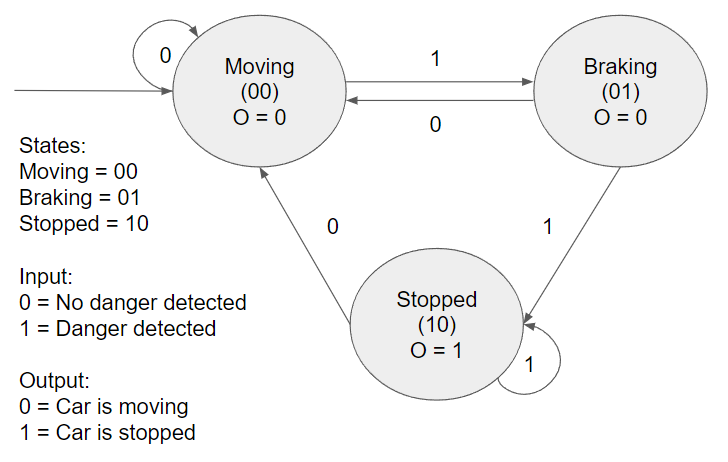

# FSM
Nathan Darien Tanner

L1BC

2602225656

## Finite State Machine
A finite state machine is a "machine" or process that has a finite number of states and rules dictating when the machine moves from one state to the other.

## Automatic Braking System
The system is an automatic braking system circuit that receive inputs from signs of danger. The states that are present for this fsm system are moving (00), braking(01), and stopped(10). There are two different situations that produce inputs to the automatic braking system. The first situation is the system not sensing danger which means that the car will continue to move, and the other situation is where the car senses danger and proceeds to activate the braking system which will lead to the car stopping. Once the system no longer senses danger the car will continue to move again.

### FSM Diagram:

### State and Transition table:

### Karnaugh Map:

#### S'0

#### S'1

#### Output

## Visualisation
This is the visualization of the car moving when there is no danger(0)

This is the visualization of the car sensing danger(1) and moving slower by braking, if the car still senses danger(1) it will come to a stop and once it doesn't sense danger anymore(0) it will continue to move, alternatively if when braking the car doesn't sense danger anymore(0), it will continue moving like before.

.gif)
